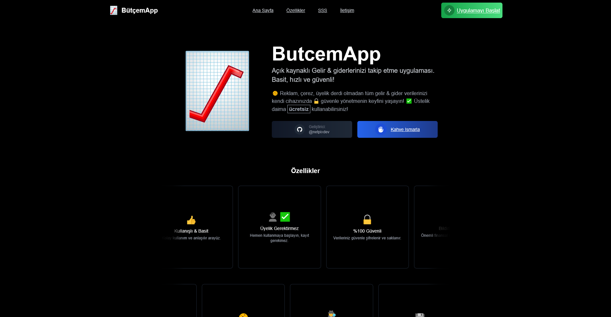

# BütçemApp

BütçemApp, gelir ve giderlerinizi takip etmenize yardımcı olan açık kaynaklı bir web uygulamasıdır. Basit, hızlı ve güvenli bir şekilde finansal durumunuzu yönetmenizi sağlar.

## Özellikler

- 🍪 Reklam, çerez ve üyelik gerektirmez
- 🔒 Tüm veriler kullanıcının cihazında güvenle saklanır
- 💰 Gelir ve giderleri kolayca takip etme
- 📊 Finansal durumunuzu görselleştirme
- 🌐 Çoklu para birimi desteği
- 📱 Mobil uyumlu tasarım

## Ekran Görüntüsü

## Nasıl Kullanılır

1. Uygulamayı açın: [BütçemApp](https://butcemapp.vercel.app)
2. "Uygulamayı Başlat" butonuna tıklayın
3. Gelir ve giderlerinizi ekleyin
4. Finansal durumunuzu takip edin

## Teknolojiler

- [Next.js](https://nextjs.org/)
- [React](https://reactjs.org/)
- [Tailwind CSS](https://tailwindcss.com/)
- [TypeScript](https://www.typescriptlang.org/)

## Yerel Geliştirme

Projeyi yerel makinenizde çalıştırmak için:
bash
git clone https://github.com/yourusername/butcemapp.git
cd butcemapp
npm install
npm run dev

Tarayıcınızda `http://localhost:3000` adresini açın.

## Katkıda Bulunma

Katkılarınızı memnuniyetle karşılıyoruz! Lütfen bir Pull Request açın veya bir Issue oluşturun.

## Lisans

Bu proje [MIT lisansı](LICENSE) altında lisanslanmıştır.

## İletişim

Geliştirici: [@netpixdev](https://github.com/netpixdev)

Bir sorunuz veya öneriniz varsa, lütfen bir Issue açın veya bana doğrudan ulaşın.

---

☕ Bu projeyi beğendiyseniz, bana bir kahve ısmarlayabilirsiniz!

